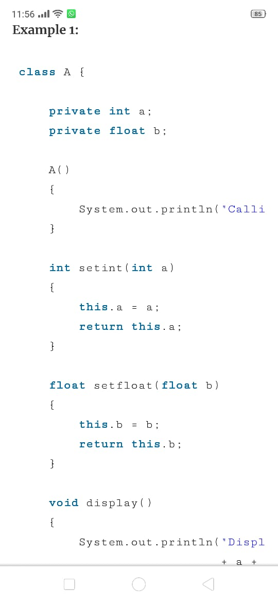
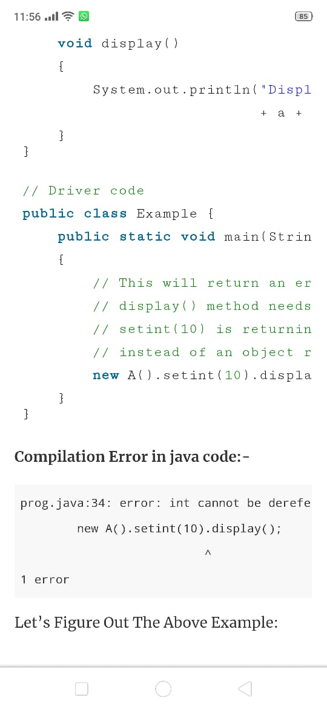

# An Empirical Study of Method Chaining in Java

* **Tomoki Nakamaru**
* **nakamaru@csg.ci.i.u-tokyo.ac.jp**
* **The University of Tokyo**

* **Tomomasa Matsunaga**
* **matsunaga@csg.ci.i.u-tokyo.ac.jp**
* **The University of Tokyo**

* **Tetsuro Yamazaki**
* **yamazaki@csg.ci.i.u-tokyo.ac.jp**
* **The University of Tokyo**

* **Soramichi Akiyama**
* **akiyama@ci.i.u-tokyo.ac.jp**
* **The University of Tokyo**

* **Shigeru Chiba**
* **chiba@acm.org**
* **The University of Tokyo**

# Introduction:-
Method Channing is the practice of calling different methods in a single line instead of calling different methods with the same object reference separately. Under this procedure, we have to write the object reference once and then call the methods by separating them with a (dot.). Lets and it the example first and then it will be much smoother to explain.

# Methodology:-
To build the dataset, research collected 2814 Java repositories on GitHub. 10th, 2019 and Dec 21st, 2019, Research collected   them by monitoring the response of the GitHub API every day during that period. The year-end revision of a year is the latest revision made in the year. We marked a java files as syntactically valid when Java Passes, a passes often used both in industry and academic, successfully passes the contend of file.
To find the year-end revisions, they use the command git  rev-list <branch>, which list all the revisions reachable from <branch>.

# Result:-
This paper presented analysis quantitatively revealed the used spread an increasing trend of method changing. To provide information of future language library development Result Support the acceptance of method changing in the real world, user studies need to be carried out to assert the acceptance.
