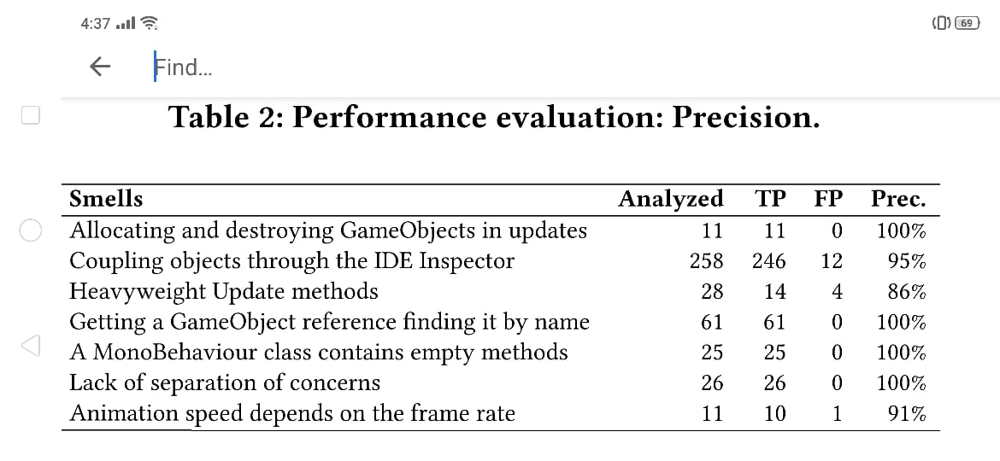
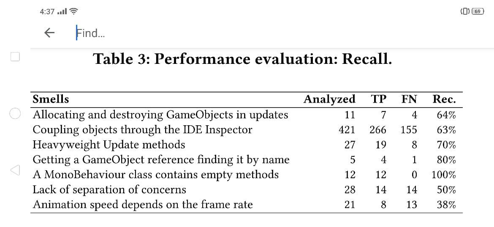
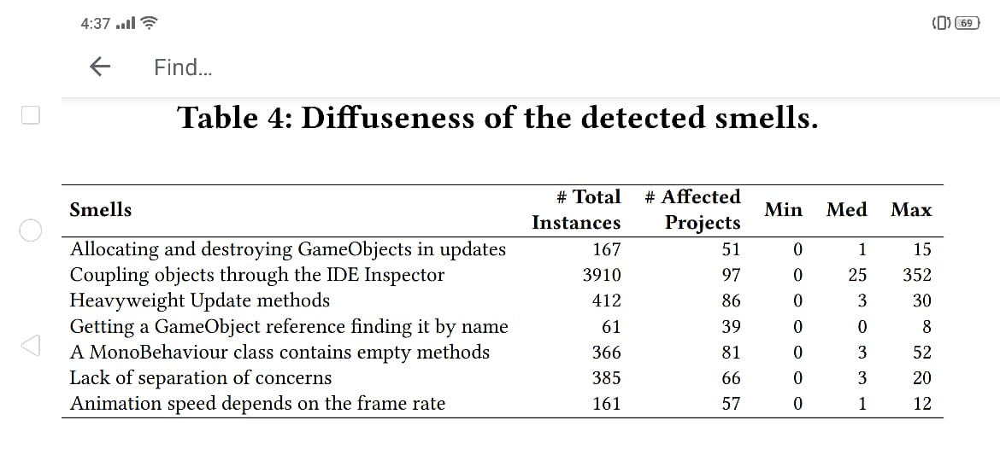

# Detecting Video Game-Specific Bad Smells in Projects

* **Antonio Borrelli**
**University of Sannio**
**Benevento, Italy**
**aborrelli@unisannio.it**

* **Vittoria Nardone**
**University of Sannio**
**Benevento, Italy**
**vnardone@unisannio.it**

* **Giuseppe A. Di Lucca**
**University of Sannio**
**Benevento, Italy**
**dilucca@unisannio.it**

* **Gerardo Canfora**
**University of Sannio**
**Benevento, Italy**
**canfora@unisannio.it**

* **Massimiliano Di Penta**
**University of Sannio**
**Benevento, Italy**
**dipenta@unisannio.it**

# Introduction:-
video game market is increasing day by day, development skills in this area still repreasent a nich. Just to give an idea stack overflow features over 1.5M discussions tagged [java] and 1.2M tagged Android, while only 50k are about Unity 3D. Developers may need suitable support while creating their games. Helping them to avoid introducing performance bottlenecks, are making the game difficult to maintain and evolve. In this paper, we propose Unity Linter. A linter for video games developed with Unity. While there are many other video games development frameworkers. E.g. Unreal are Blender we have chosen Unity because it is free (within certain usage limits) and for this reason, it has also been adopted in the open-source community as well as for educational purpose. Unity Linter statically analyze the source code (written in C#) and other artifacts of a Unity video game code smells. Such smells cover different quality aspects of video game development, namely performance, maintainability, and correct behavior.

# Methodology:-
Lets apply Unity Linter on a set of projects, to (i) validate its accuracy, and (ii) Study the magnitude of the investigated smells. To this purpose, we considered 100 Unity projects. We have downloaded them from GitHub choosing only the project which have the sentence “Game in Unity” in their description. We perform a manual evaluation of the detected smells among the 5461 detected one, where strata are completed based on the proportion of different smell types. This sample ensures a +- 5% since one smell (Getting Game Object reference finding it by name) has a fairly  limited number of instances hence reaching a number of 420 smells to be manually analysed in total.

 

# Result:-
Studied small types affects a proportion of project signing between 39% and 97% while coupling objects through the IDE Inspector is highly diffused (bed also considered as an acceptable development practice) smells such as getting a GameObject reference finding it by name allocating and destroying GameObjects in updates, and animation speed depends on the frame rate are more acknowledge by developers and also occur in fewer projects.
Unity Linter precision ranges between 86% and 100% whereas recall between 50% and 100%. Sources of imprecision and limited recall are due to the approximate data flow analysis, and other heuristics of a lightweight analysis.
